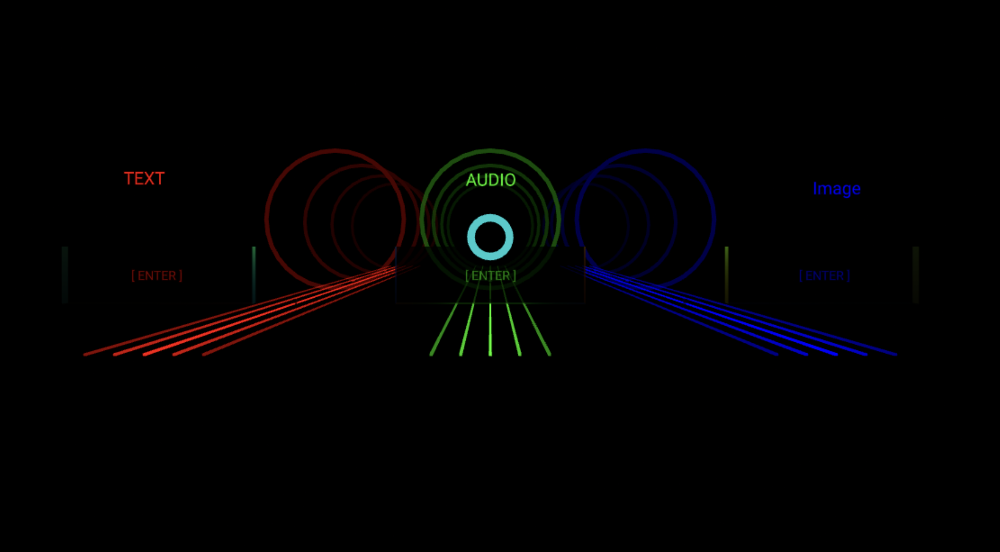
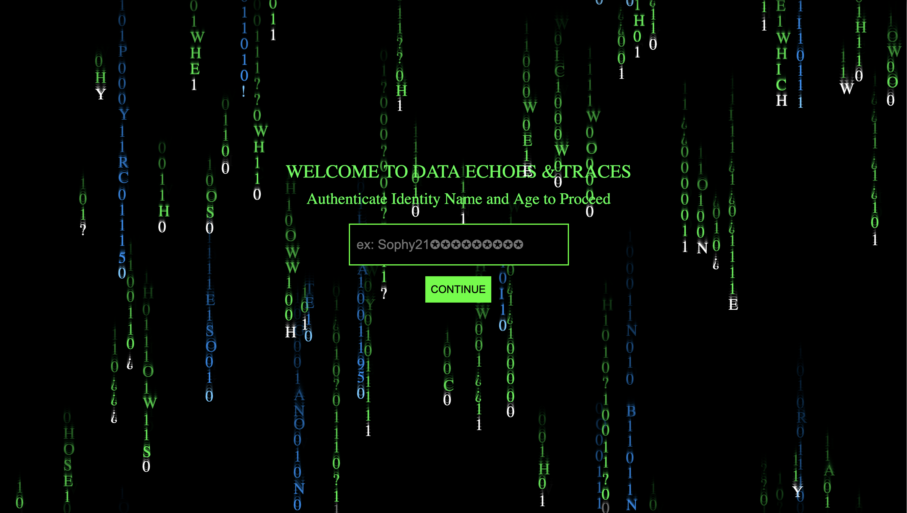
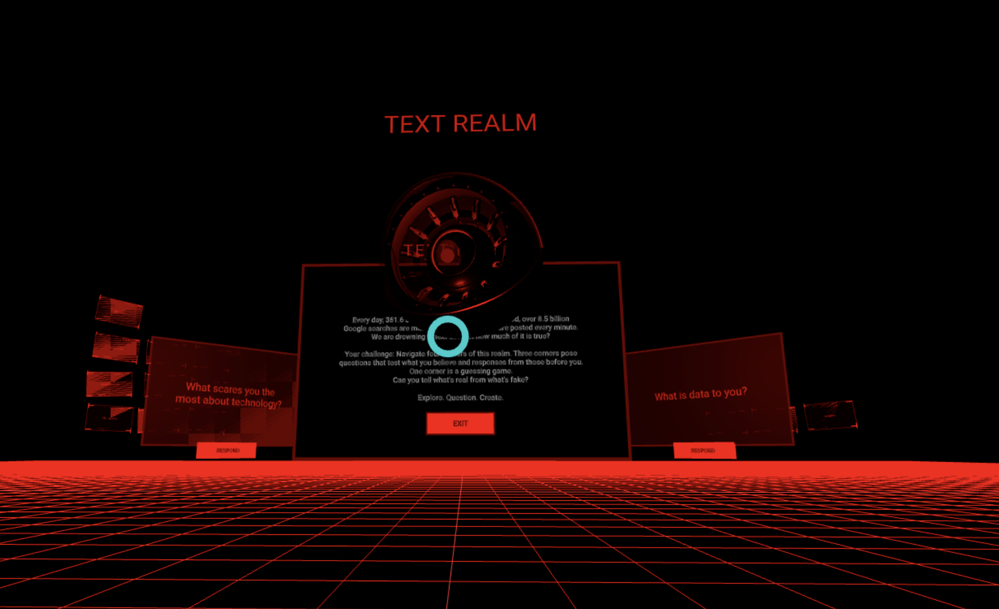
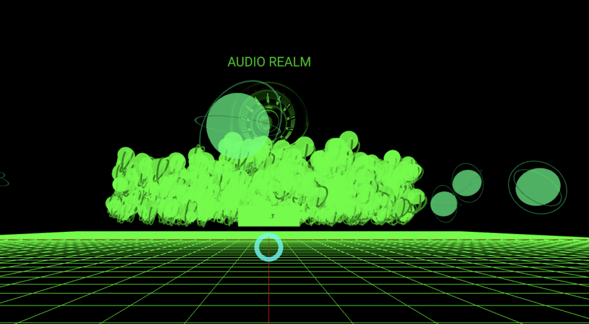
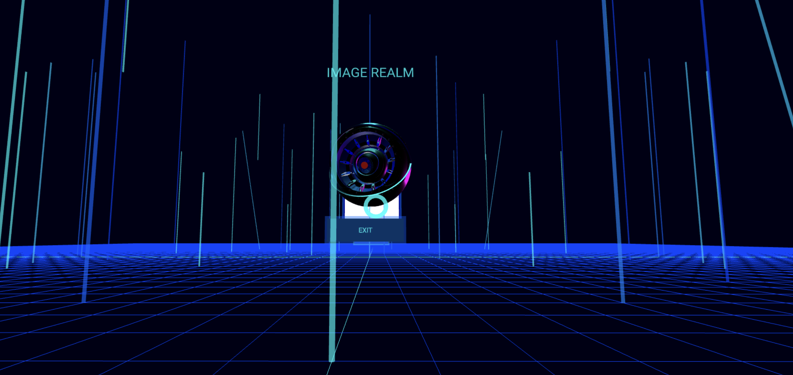

# Data Echoes & Traces: A VR Installation



**MS190 Senior Project - Fall 2025**

An interactive VR art installation exploring themes of data embodiment, techno-transcendence, digital surveillance, and the challenge of distinguishing authentic from fabricated information.

## Creator
- Sophy Figaroa

## Project Overview

Data Echoes & Traces is an immersive WebXR experience that examines how users leave permanent digital traces while navigating challenges around data privacy, misinformation, and AI-generated content. The installation guides visitors through three interconnected scenes, each designed to provoke reflection on our digital existence.

### Three Scenes

1. **Digital Rain Login (Scene 1)**
   - Matrix-inspired data visualization
   - Interactive "secret" collection system
   - Built with p5.js
   - Sets the tone for digital exploration



2. **VR Cyberspace (Scene 2 - Main Experience)**
   - Three themed realms accessible through portal navigation
   - Immersive VR environment with controller-based movement
   - Cross-device data persistence via Supabase
   - Scaled for 10ft × 5ft physical space


3. **Pixel Mirror (Scene 3) *In Development* **
   - Real-time camera feed processing
   - Reflection on surveillance and digital self
   - Pixel art aesthetic

### The Three Realms in Scene 2

**🔴 Text Realm (Red)**
- Philosophical questions about truth and fiction
- AI vs. human writing detection challenges
- Interactive text input via VR keyboard
- Permanent text traces stored as data echoes



**🟢 Audio Realm (Green)**
- Voice recording system with spatial audio spheres
- AI vs. real audio detection games
- Persistent audio artifacts in virtual space
- Web Audio API integration



**🔵 Image Realm (Blue)** *In Development*
- Hand tracking and gesture-based interaction
- AI vs. real image authentication challenges
- Neon ghost trails showing movement history
- Real-time visual effects with Three.js shaders



---

## Technical Stack

### Core Technologies
- **A-Frame 1.4.0** - WebXR framework
- **Three.js** - 3D graphics and custom shaders
- **p5.js** - Digital rain visualization
- **Supabase** - Real-time database for data persistence
- **Web Audio API** - Voice recording and playback
- **MediaRecorder API** - Audio capture

### Development Tools
- VS Code with Live Server extension
- Git/GitHub for version control
- GitHub Pages for web deployment
- Meta Quest 2 for VR testing

### Architecture Highlights
- Component-based A-Frame architecture
- Scene management system for smooth realm transitions
- Persistent storage system (all user data saved to database)
- Responsive design scaled for physical installation space
- Kiosk Mode configuration for exhibition deployment

---

## Installation

### Prerequisites
- Modern web browser (Chrome, Firefox, Edge)
- HTTPS server (required for WebXR)
- Git
- **For VR**: Meta Quest 2 or compatible WebXR headset
- **Optional**: Node.js and npm (for local development server)

### Step 1: Clone the Repository

```bash
git clone https://github.com/[your-username]/FIGAROA.git
cd FIGAROA
```

### Step 2: Set Up Local HTTPS Server

**Option A: Using Python (Simple)**
```bash
# Python 3
python -m http.server 8000
```
⚠️ Note: WebXR requires HTTPS. For local testing, use GitHub Pages or ngrok.

**Option B: Using Live Server (VS Code)**
1. Install "Live Server" extension in VS Code
2. Right-click `index.html`
3. Select "Open with Live Server"

**Option C: Using Node.js**
```bash
npm install -g http-server
http-server -S -C cert.pem -K key.pem
```

### Step 3: Configure Supabase (Optional)

If you want to enable data persistence:

1. Create a Supabase project at [supabase.com](https://supabase.com)
2. Copy your project URL and anon key
3. Update `config.js`:

```javascript
const SUPABASE_URL = 'your-project-url';
const SUPABASE_KEY = 'your-anon-key';
```

4. Create the required table:
```sql
CREATE TABLE data_echoes (
  id SERIAL PRIMARY KEY,
  realm TEXT NOT NULL,
  content TEXT,
  timestamp TIMESTAMPTZ DEFAULT NOW()
);
```

### Step 4: Access the Experience

**Desktop (2D Preview):**
```
http://localhost:8000
```

**VR Headset:**
1. Deploy to GitHub Pages or use ngrok for HTTPS
2. Open the URL in Meta Quest browser
3. Click "Enter VR" button

---

## Running the Experience

### Web Deployment (Recommended)

**GitHub Pages:**
1. Push your code to GitHub
2. Go to Settings → Pages
3. Select branch and root folder
4. Access at `https://[username].github.io/FIGAROA`

### Local Development

```bash
# Start local server with HTTPS
python -m http.server 8000

# Or use Live Server in VS Code
```

### VR Headset Setup

**Meta Quest 2:**
1. Enable Developer Mode
2. Navigate to deployed HTTPS URL
3. Click "Enter VR" button
4. Use controllers for navigation:
   - **Thumbstick**: Move forward/backward/strafe
   - **Trigger**: Select/interact
   - **Grip**: Secondary interactions

---

## Physical Installation Setup

### Space Requirements
- **Minimum**: 10ft × 5ft clear floor space
- **Recommended**: 12ft × 6ft for safety buffer
- **Height clearance**: 8ft minimum

### Equipment Checklist
- [ ] Meta Quest 2 headset (fully charged)
- [ ] Charging cable and power adapter
- [ ] WiFi connection (for Supabase sync)
- [ ] Boundary markers for play space
- [ ] Lens cleaning cloth
- [ ] Backup headset (recommended)

### Kiosk Mode Configuration

Configure Quest for auto-launch:
1. Enable Kiosk Mode in Meta Quest settings
2. Set Data Echoes & Traces as default app
3. Disable browser navigation controls
4. Set up automatic session reset


---

## Contributing

This is a course final project, but feedback and suggestions are welcome!

1. Fork the repository
2. Create a feature branch
3. Submit a pull request with detailed description

---

## License

This project is created as part of my senior exercise for Media Studies at Pomona College.

---

## Contact

**Sophy Figaroa**
- GitHub: [@sophycodes](https://github.com/sophycodes)
- Project Link: [https://sophycodes.github.io/MS190-Code/](https://sophycodes.github.io/MS190-Code/)

---
